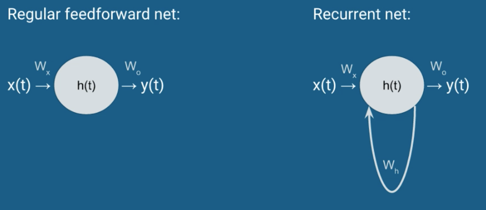

## Section 2: The Simple Recurrent Unit

- Also known as the Elman Unit
- Sequences
  - We are used to tabular data: $X \times D$ matrix (no sequence)
  - What if the data has sequence? What are the dimensions then?
    - $X(1) = (D,), X(2)=(D,), \cdots, X(T)=(D,) \rightarrow$ $T \times D$ matrix
    - Total: $N \times T \times D$
    - Sequences can also have different lengths
      - Store each observation as a list in Python
      - The n-th element is $T(n) \times D$
- A simple recurrent unit:  

- How big is $W_h$?
  - It connects everything to everything
  - If there are $M$ hidden units on the layer, each recurrent unit will connect to all hidden units of the layer, thus the size of $W_h$ is $M \times M$
- Mathematical representation:
  - $h(t) = f(W_h^T h(t-1) + W_x^T x(t) + b_h)$
  - $y(t) = softmax(W_o^T h(t) + b_o)$
  - where $f$ can by any activation function (tanh, sigmoid, relu, etc.)
- Note that this is not the Markov property!
  - $h(t) = f(W_h^T h(t-1) + W_x^T x(t) + b_h)$
  - $h(t) = f(W_h^T f(W_h^T h(t-2) + W_x^T x(t-1) + b_h) + W_x^T x(t) + b_h)$
  - ......
  - $h(0)=?$, some researcher set it as 0, it is a hyper-parameter
