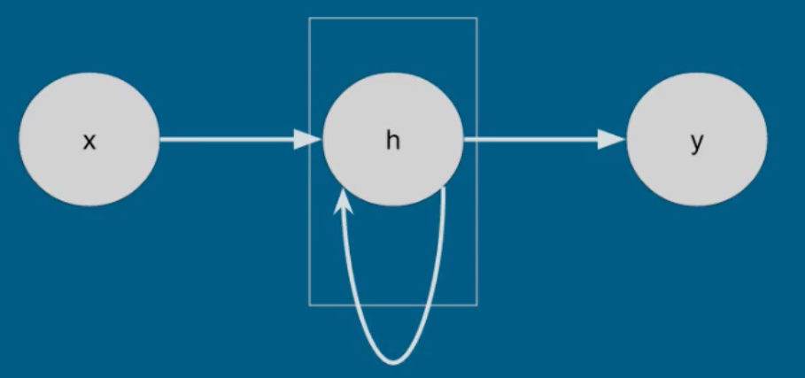
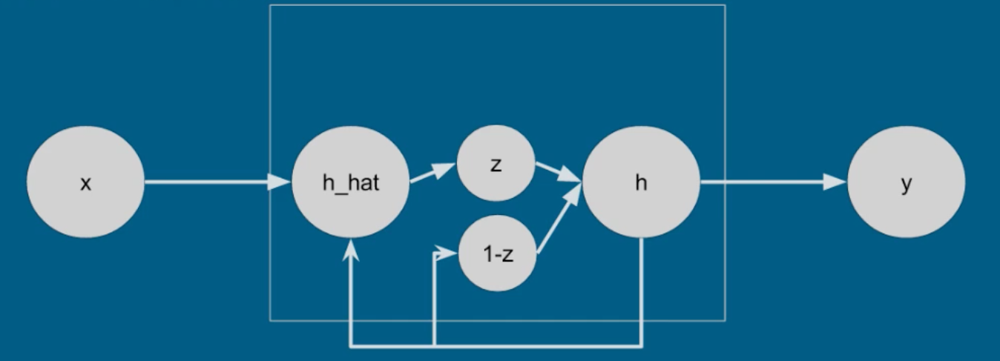
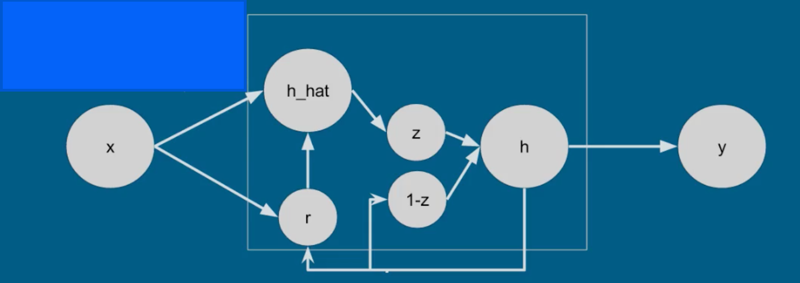
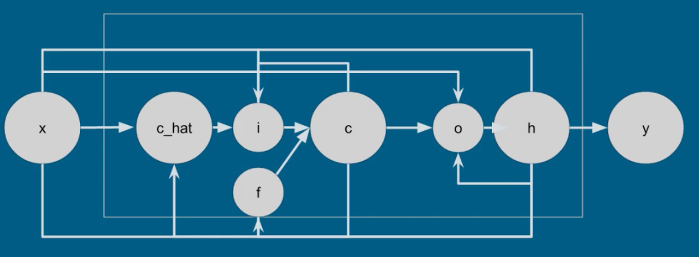

## Section 2: The Simple Recurrent Unit

- Also known as the Elman Unit
- Sequences
  - We are used to tabular data: $X \times D$ matrix (no sequence)
  - What if the data has sequence? What are the dimensions then?
    - $X(1) = (D,), X(2)=(D,), \cdots, X(T)=(D,) \rightarrow$ $T \times D$ matrix
    - Total: $N \times T \times D$
    - Sequences can also have different lengths
      - Store each observation as a list in Python
      - The n-th element is $T(n) \times D$
- A simple recurrent unit:  

- How big is $W_h$?
  - It connects everything to everything
  - If there are $M$ hidden units on the layer, each recurrent unit will connect to all hidden units of the layer, thus the size of $W_h$ is $M \times M$
- Mathematical representation:
  - $h(t) = f(W_h^T h(t-1) + W_x^T x(t) + b_h)$
  - $y(t) = softmax(W_o^T h(t) + b_o)$
  - where $f$ can by any activation function (tanh, sigmoid, relu, etc.)
- Note that this is not the Markov property!
  - $h(t) = f(W_h^T h(t-1) + W_x^T x(t) + b_h)$
  - $h(t) = f(W_h^T f(W_h^T h(t-2) + W_x^T x(t-1) + b_h) + W_x^T x(t) + b_h)$
  - ......
  - $h(0)=?$, some researcher set it as 0, it is a hyper-parameter
- We can obviously have many recurrent units/layers and this depends on what model works the best.
- In prediction:
  - The original softmax is: $\argmax_k P(y=k|x) = \agmax_k softmax(W_o^T h(x) + b_o)$
    - This assumes that there is no time component
    - It also assumes that one class per one input, which makes sense for most of the problems, but not all.
- Example 1: differentiate between male and female voices
  - Adding the time component: $\argmax_k P(y(t)=k|x) = \agmax_k softmax(W_o^T h(x) + b_o)$
    - It is possible to have one $y(t)$ for each $h(t)$ (time step)
- Example 2: brain-computer interaction
  - use EEG to control wheelchair
  - we want fine-control of the wheelchair, that is, do the action as we think of it, thus we will need y(t) for each x(t)
- Example 3: word sequences
  - predict next word given all previous words (target is next word)
  - unsupervised
  - $p(x(t) | x(t-1), \cdots, x(1))$
  - Consider the whole sequence, we have:
    - $P(x(1)) P(x(2)|x(1)) P(x(3)|x(2),x(1)) \cdots$
    - Using chain rule of probability, this is essentially the joint probability of the whole sequence
- Intuitively, the RNN is trying to optimize the joint probability, which is the same as HMM, and without the assumption of Markov property.
- Moreover, in HMM, longer sequences have probabilities that approach 0, but we do not need to calculate it here in RNN.
- In summary, RNN can:
  1. predict one label over entire sequence
  2. predict a label for each step of input sequence
  3. predict the next value in sequence
- DIfferent recurrent units:
  1. Simple recurrent unit

  2. Rates recurrent unit

  3. Gate recurrent unit

  4. Long short term meomry (LSTM) recurrent unit

